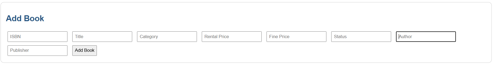
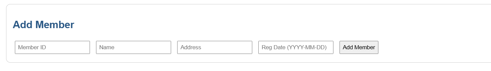
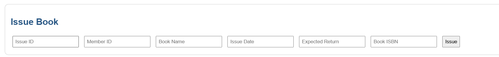
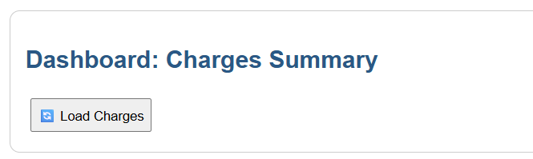

# 📚 Library Management System

A web-based Library Management System built using **Flask** and **MySQL** that helps librarians and members manage book lending, track due dates, and maintain a digital library record efficiently.

---

## 🚀 Features

* ✅ Add, update, and delete books
* ✅ Register and manage students/members
* ✅ Issue and return books with due dates
* ✅ Track issued/returned books per student
* ✅ **Calculate late return fines** based on due date
* ✅ **Display total payable amount** when returning a book
* ✅ Search books by title, author, or category
* ✅ Dashboard with statistics (books issued, overdue, etc.)
* ✅ Filter/search issued books
* ✅ Simple and clean user interface

---

## 💰 Fine Calculation Feature

When a user returns a book after the due date, the system:

* Calculates the number of overdue days
* Multiplies the days by a configurable fine rate (e.g., ₹5/day)
* Displays the **total fine** to the librarian or student
* Adds this amount to the return record

Example:

```
Book Due Date: 10 July 2025
Return Date:   15 July 2025
Fine Rate:     ₹5/day
Total Fine:    ₹25
```

You can change the fine rate in the configuration settings.

---

## 🛠️ Technologies Used

* **Backend:** Python (Flask)
* **Database:** MySQL
* **Frontend:** HTML, CSS
* **Extensions:** Flask-MySQLdb, Jinja2 templates, datetime module

---

## 🗂️ Project Structure

```
library-management/
│
├── app.py                # Main Flask app with routes
├── config.py             # MySQL credentials
├── templates/            # Jinja2 HTML files
├── static/               # Static files (CSS, JS, images)
├── requirements.txt      # Python packages
└── README.md             # Project documentation
```

---

## ✅ TODOs / Future Enhancements

* [ ] Login system for librarians and students
* [ ] PDF report generation (monthly transactions)
* [ ] Book reservation system
* [ ] Notification/email alerts for due/overdue books
* [ ] REST API for frontend/backend separation

---

## 📸 Screenshots

### 🖼️ Add Book Page



### 🖼️ Add Member Page



### 🖼️ Issue Book Page



### 🖼️ Return Book with Fine Calculation


### 🖼️ Dashboard Summary



---

## 🤝 Contributing

Pull requests are welcome. You can help by adding features, fixing bugs, or improving the UI.

---

## 📄 License

This project is licensed under the MIT License.

---


